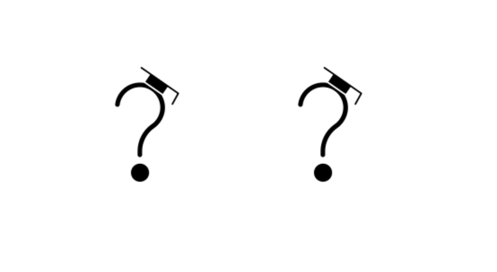
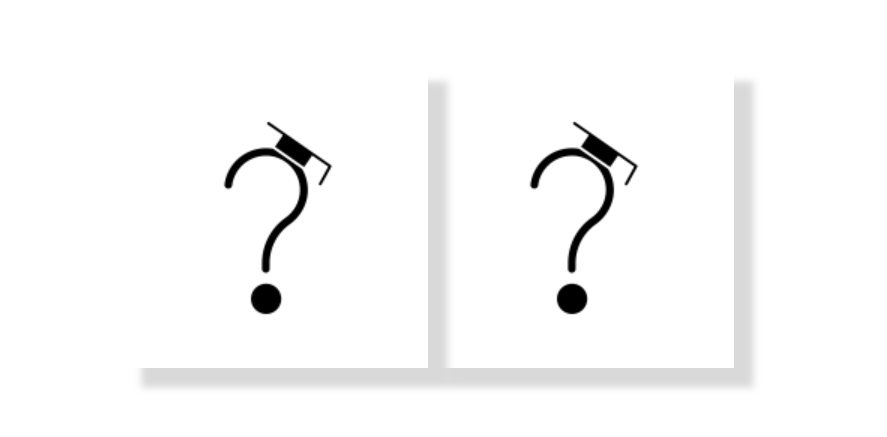

# what is this?

Get perfect shadows every time for all images.

# Installation 

`npm i shadowizard_images --save`

Then...

```
import { shadowizard_images } from 'shadowizard_images';

shadowizard_images({
    shadow_type: 'low',
    padding: false
});

```

## How to Use

* *Step 1* : add images like, <imgTag with src="path">
* *Step 2* : assign class to all images like, ""


## Properties

shadowizard_images supports two(2) properties, which are optional:

* *shadow_type* - _high | low_ (Defaults shadow_type property is low)
* *padding* - _boolean_ (Default padding property is false)

## Images

* Before



* After


